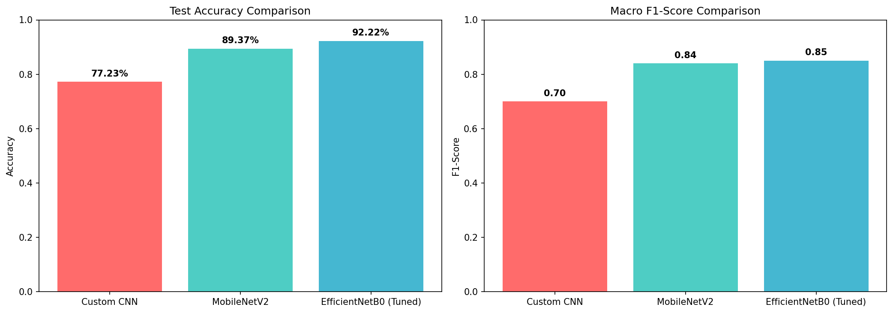
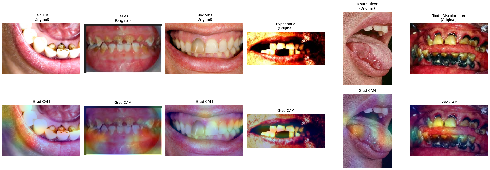

# 🦷 Oral Disease Classification

An end-to-end deep learning project that classifies oral/dental conditions from a single image using transfer learning, with a live deployed web app for real-time predictions.

**🔗 Live Demo:** [oral-disease-classification.streamlit.app](https://oral-disease-classification-dlmkatjxeebmrbgdewtzdr.streamlit.app)



---

## 📌 Overview

This project builds and compares three deep learning models to classify images into **6 oral disease categories**:

- Calculus
- Caries
- Gingivitis
- Hypodontia
- Mouth Ulcer
- Tooth Discoloration

The final model is deployed as an interactive web application where users can upload an image and get an instant prediction with confidence scores.

## 🎯 Key Results

| Model | Test Accuracy | Macro F1 | Parameters |
|---|---|---|---|
| Custom CNN (baseline) | 77.2% | 0.70 | 0.46M |
| MobileNetV2 (Transfer Learning) | 89.4% | 0.84 | 2.58M |
| **EfficientNetB0 (Tuned)** ⭐ | **93.4%** | **0.88** | 4.64M |

The final tuned EfficientNetB0 model achieved a **+16% accuracy improvement** over the custom CNN baseline, driven primarily by transfer learning and a systematic hyperparameter search.

## 🔍 Model Interpretability (Grad-CAM)

To verify the model is learning meaningful visual features rather than spurious correlations, Grad-CAM was used to visualize which regions of each image the model focuses on when making a prediction.



The heatmaps confirm the model concentrates on clinically relevant regions (e.g., the ulcer itself, gaps between teeth for hypodontia, discolored/decayed tooth surfaces) rather than background noise.

## 🧪 Methodology

### 1. Data Preparation
- Source dataset: [Oral Diseases (Kaggle)](https://www.kaggle.com/datasets/salmansajid05/oral-diseases)
- Started with 5,563 raw images across 6 classes
- **MD5-based deduplication** to remove exact duplicate images
- Identified and removed **392 images with conflicting labels** across classes (same image hash appearing under two different disease labels) — a critical data quality issue that would have caused label leakage
- Final clean dataset: **3,507 images**

### 2. Data Splitting
- Stratified 70/15/15 train/validation/test split
- Verified **zero overlap** between splits (no data leakage) via hash comparison

### 3. Handling Class Imbalance
- Combined approach: **class weights** (computed on the training set) + **on-the-fly data augmentation** (flip, rotation, zoom, contrast) applied only to the training pipeline

### 4. Model Training
- **Custom CNN**: built from scratch as a baseline (4 conv blocks + GAP + dense head)
- **MobileNetV2** & **EfficientNetB0**: transfer learning with frozen ImageNet-pretrained backbones, custom classification head
- Callbacks: EarlyStopping, ReduceLROnPlateau, ModelCheckpoint

### 5. Hyperparameter Tuning
- Grid search over dropout rate, dense layer width, and learning rate on the best-performing architecture (EfficientNetB0)
- Best configuration: dropout=0.4, dense units=512, lr=1e-3

### 6. Explainability
- Grad-CAM visualizations generated on the final model's last convolutional layer

### 7. Deployment
- Streamlit web application with image upload, real-time inference, and confidence visualization
- Deployed on Streamlit Community Cloud

## 🛠️ Tech Stack

- **Deep Learning:** TensorFlow / Keras
- **Data Processing:** Pandas, NumPy, Pillow
- **Evaluation:** Scikit-learn (classification metrics, stratified splitting)
- **Visualization:** Matplotlib, Seaborn
- **Deployment:** Streamlit, Streamlit Community Cloud
- **Environment:** Kaggle Notebooks (GPU-accelerated training)

## 📂 Repository Structure

```
oral-disease-classification/
├── app.py                          # Streamlit web application
├── requirements.txt                 # Python dependencies
├── final_oral_disease_model.keras   # Trained EfficientNetB0 model
├── runtime.txt                      # Python version pin for deployment
└── assets/                          # Charts and visualizations
    ├── model_comparison.png
    ├── final_confusion_matrix.png
    └── gradcam_examples.png
```

## 🚀 Running Locally

```bash
git clone https://github.com/youssef-kazoun/oral-disease-classification.git
cd oral-disease-classification
pip install -r requirements.txt
streamlit run app.py
```

## ⚠️ Disclaimer

This project is for **educational and portfolio purposes only**. It is not a certified medical diagnostic tool and should not be used as a substitute for professional dental consultation.

## 📄 Dataset Credit

[Oral Diseases Dataset](https://www.kaggle.com/datasets/salmansajid05/oral-diseases) by Salman Sajid, Kaggle.

---

**Author:** Youssef Kazoun
